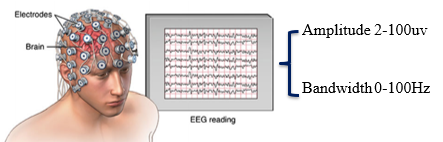
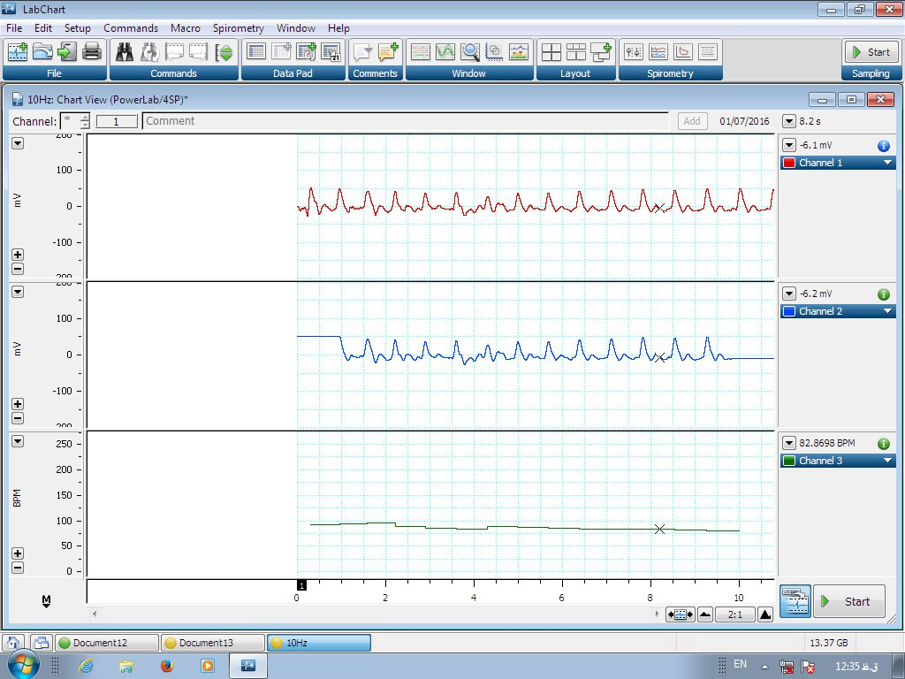

<head>
    <title>The Vital Importance of Data Acquisition, with Emphasis on Biosignals</title>
</head>

    
<body>
    <h1>The Vital Importance of Data Acquisition, with Emphasis on Biosignals</h1>

    <h2>Introduction</h2>
    
In today's data-driven world, the ability to acquire, process, and analyze data has become indispensable across various fields. Data acquisition, the process of collecting information from various sources, has gained significant prominence, especially in the realm of biosignals. Biosignals encompass a wide range of biological data, including electrocardiograms (ECG), electroencephalograms (EEG), electromyograms (EMG), and more. These biosignals offer a unique window into the inner workings of the human body, making their acquisition and analysis crucial for advancements in healthcare, research, and numerous other domains.

<strong>When I was in my bachelor's degree program, I had an experience in data recording, and it was a really important part of the work. We mustn't do any mistakes.</strong>

    <!-- Insert your picture here -->
        
       

        
    

    <h2>Advancements in Healthcare</h2>
    
One of the most profound impacts of biosignal data acquisition is in the field of healthcare. The ability to monitor and record biosignals allows healthcare professionals to diagnose, treat, and manage a wide range of medical conditions with precision. For instance, ECGs are vital in diagnosing heart conditions such as arrhythmias and heart attacks, while EEGs help in identifying neurological disorders like epilepsy. Without the ability to acquire these biosignals accurately, timely diagnosis and treatment would be significantly compromised, potentially leading to detrimental outcomes for patients.

    <h2>Medical Research and Innovation</h2>
    
In addition to healthcare, biosignal data acquisition plays a pivotal role in advancing medical research and innovation. Researchers rely on biosignals to study various physiological processes and develop new therapies and technologies. For example, EMG data can be used to analyze muscle activity and develop prosthetic limbs with better control and responsiveness. EEG data helps researchers study brain function, leading to breakthroughs in understanding neurological disorders and brain-computer interfaces. Without robust data acquisition techniques, these critical research endeavors would be severely hampered.

    <h2>Personalized Medicine</h2>
    
The era of personalized medicine has been significantly facilitated by biosignal data acquisition. By continuously monitoring an individual's biosignals, healthcare providers can tailor treatment plans to the specific needs of each patient. This approach is particularly important in chronic conditions like diabetes, where continuous glucose monitoring through biosignal data acquisition allows for precise insulin administration. Personalized medicine not only improves patient outcomes but also reduces healthcare costs by minimizing unnecessary treatments and hospitalizations.

    <h2>Sports and Fitness</h2>
    
Beyond healthcare and research, biosignal data acquisition has found applications in sports and fitness. Athletes and fitness enthusiasts can monitor their heart rate, muscle activity, and other biosignals to optimize their training regimens and prevent overexertion. Wearable devices like smartwatches and fitness trackers have become commonplace, enabling individuals to track their biosignals and make informed decisions about their health and fitness goals.

    <h2>Environmental Monitoring</h2>
    
Biosignal data acquisition is not limited to human health; it also extends to environmental monitoring. Biosignals from wildlife, plants, and ecosystems can provide valuable insights into the health of our planet. For instance, studying biosignals in marine organisms can help scientists understand the impact of climate change on aquatic ecosystems. Similarly, monitoring biosignals in trees can aid in early detection of diseases that threaten forest health.

    <h2>Conclusion</h2>
    
In conclusion, the ability to acquire biosignal data is of paramount importance in today's world. It touches upon every aspect of our lives, from healthcare to research, from personalized medicine to sports and fitness, and even environmental monitoring. Biosignal data acquisition empowers us to gain valuable insights into the functioning of the human body and the natural world, leading to improved health, scientific discoveries, and a better understanding of the environment. As technology continues to advance, the importance of biosignal data acquisition will only grow, further enriching our lives and expanding the frontiers of knowledge.

</body>
</html>

Source: <a href="https://github.com/jogarces/ics-313-text-game"><i class="large github icon "></i>jogarces/ics-313-text-game</a>
