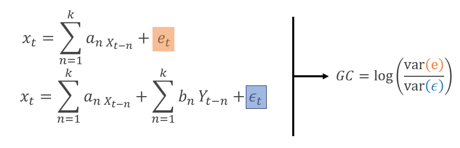
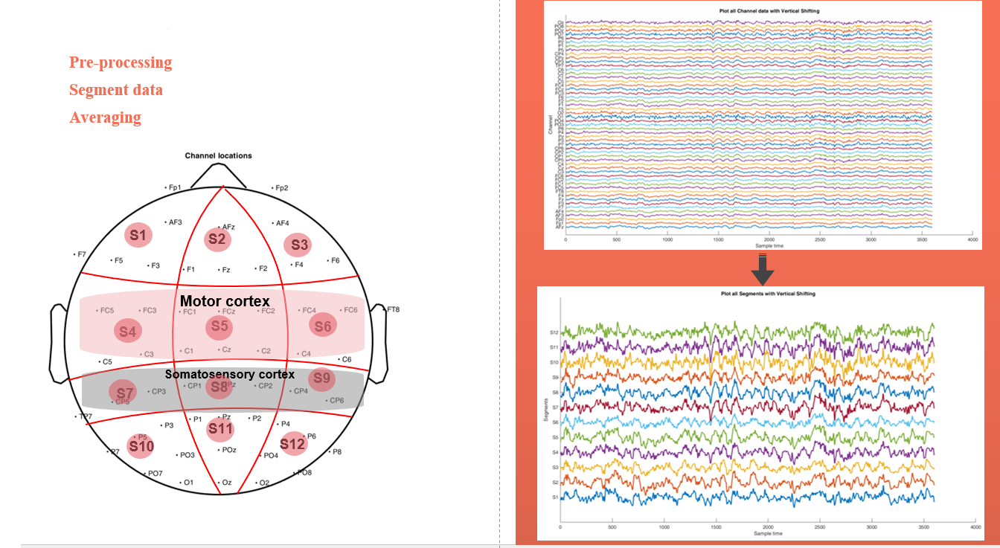
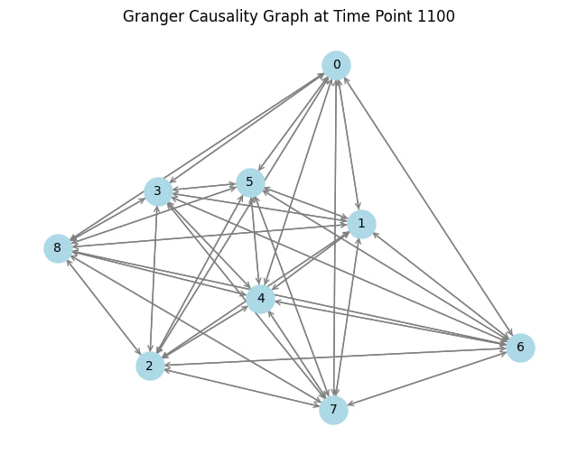
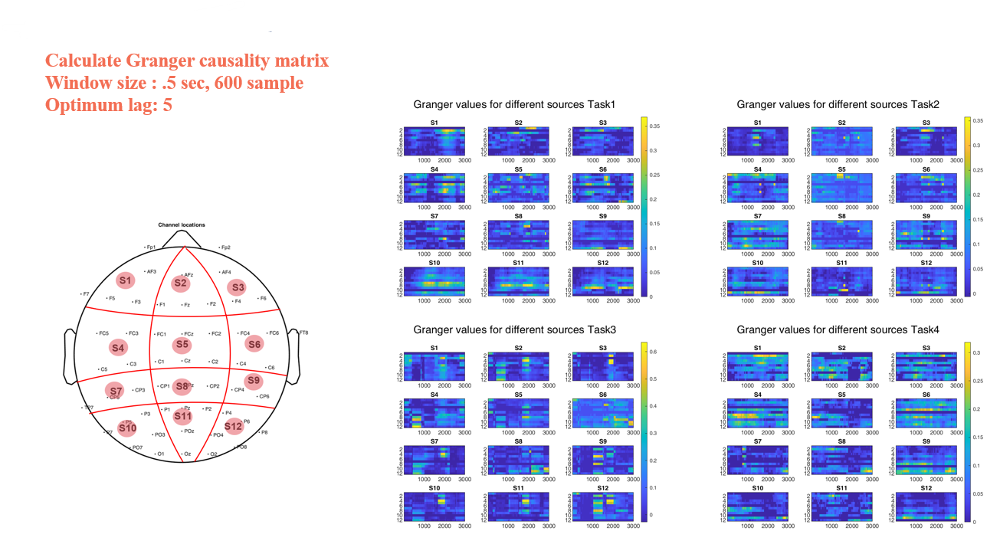
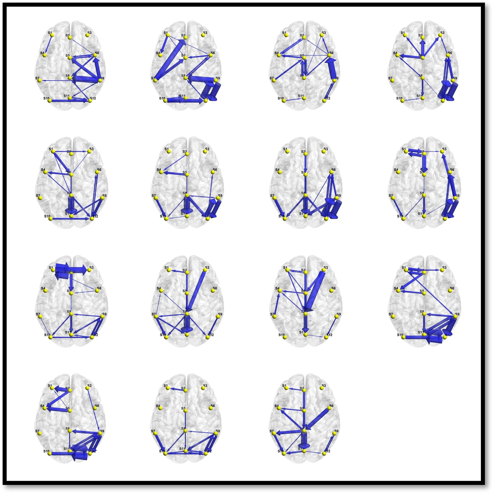

<html>
<head>
    <title>Granger Causality: Analyzing Causal Relationships</title>
    
</head>
<body>
    <h1>Granger Causality: Analyzing Causal Relationships</h1>

    

        <h2>Introduction</h2>
        
Granger Causality is a statistical hypothesis test used in econometrics, time-series analysis, and various scientific disciplines to examine causal relationships between two or more time series data. Developed by Clive Granger, a Nobel laureate in economics, this test helps researchers determine whether one time series can predict or "cause" changes in another time series.

        
Granger Causality is a valuable tool in understanding the temporal relationships between variables, making it widely applied in fields such as economics, neuroscience, and environmental science.

        

        <h2>The Granger Causality Test</h2>
        
The Granger Causality test involves comparing two time series, typically denoted as X and Y. It assesses whether the past values of X provide valuable information for predicting the future values of Y, beyond what can be predicted using past values of Y alone. If including the lagged values of X improves the prediction accuracy of Y, it is considered evidence of Granger causality from X to Y.

      

        
The Granger Causality test can be performed using statistical software or programming languages like Python or R. Researchers specify the maximum lag order, and the test calculates statistical significance to determine whether Granger causality exists.

        <h2>Applications and Significance</h2>
        
Granger Causality has numerous applications across various domains:

        <ul>
            <li>Economics: It is used to study causal relationships between economic indicators, helping economists make informed policy decisions.</li>
            <li>Neuroscience: Granger Causality is applied to fMRI data to understand how brain regions influence each other over time.</li>
            <li>Environmental Science: Researchers use it to analyze the impact of environmental factors on climate variables and ecological systems.</li>
        </ul>

        
Understanding causality is fundamental in scientific research, and Granger Causality provides a quantitative method to explore these relationships in time-series data.

        <h2>Conclusion</h2>
        
Granger Causality stands as a powerful tool for uncovering causal relationships within time-series data. Its application spans diverse fields, enabling researchers to better comprehend the temporal dependencies between variables and make informed decisions based on these insights.

        
As data-driven research continues to grow, Granger Causality remains a valuable asset for exploring causality in dynamic systems, shedding light on the intricate web of cause and effect that shapes our understanding of the world.

        <h2>My project</h2>

    <h3>EEG Data Preprocessing with the Happe Pipeline</h3>
    
The project begins with the acquisition of EEG data from 53 channels, each capturing electrical activity from different areas of the brain. To ensure the reliability and quality of the data, the Happe pipeline is employed for preprocessing. The Happe pipeline is a robust and widely used method for cleaning and preparing EEG data. It involves several steps such as noise removal, artifact correction, and referencing, all of which are essential for obtaining meaningful results in subsequent analyses.

    <h3>Segmentation for Volume Conductance Reduction</h3>
    
One crucial aspect of this project is the division of the EEG electrodes into 12 segments. This segmentation is performed with the goal of reducing volume conduction effects. Volume conduction occurs when electrical signals from one electrode spread to neighboring electrodes, leading to the possibility of spurious connectivity in subsequent analyses. By dividing the electrodes into segments, the project aims to mitigate these effects and improve the accuracy of connectivity analysis.

     

    <h3>Connectivity Analysis: Granger Causality and Other Methods</h3>
    
Following the preprocessing and segmentation steps, the project delves into connectivity analysis. One of the methods employed is Granger causality. Granger causality is a statistical approach used to assess the causal relationship between time series data. In the context of EEG data, it helps identify the directional influence between different brain regions. Granger causality is particularly valuable for understanding information flow and communication within the brain.

    
    
In addition to Granger causality, other connectivity methods may also be utilized, depending on the specific research questions and goals of the project. Common methods include coherence analysis, phase synchronization, and cross-correlation, among others. Each of these methods provides unique insights into how different EEG channels are connected and communicate with each other.

    <h3>Visualization through Graph Representation</h3>
    
To make sense of the complex connectivity patterns obtained from the EEG data, the project employs graph representation techniques. Graphs are a powerful tool for visualizing and analyzing network structures. In this context, each EEG channel is represented as a node in the graph, and the connections between channels are depicted as edges. This graphical representation allows researchers to intuitively grasp the network properties of the brain and identify key nodes or regions that play crucial roles in information processing.

 
  
  

        
    

    
</body>
</html>

